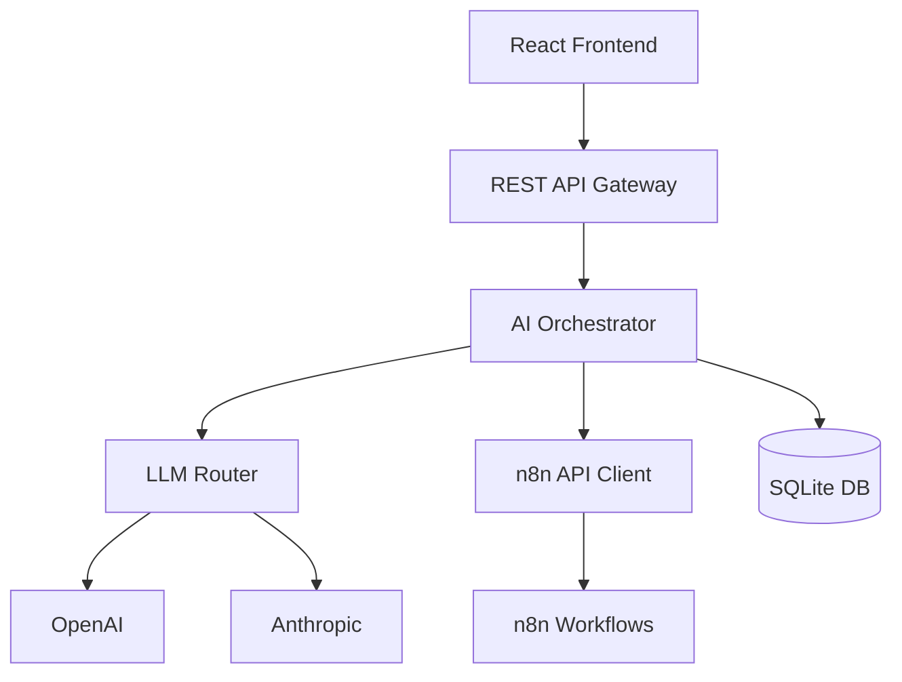
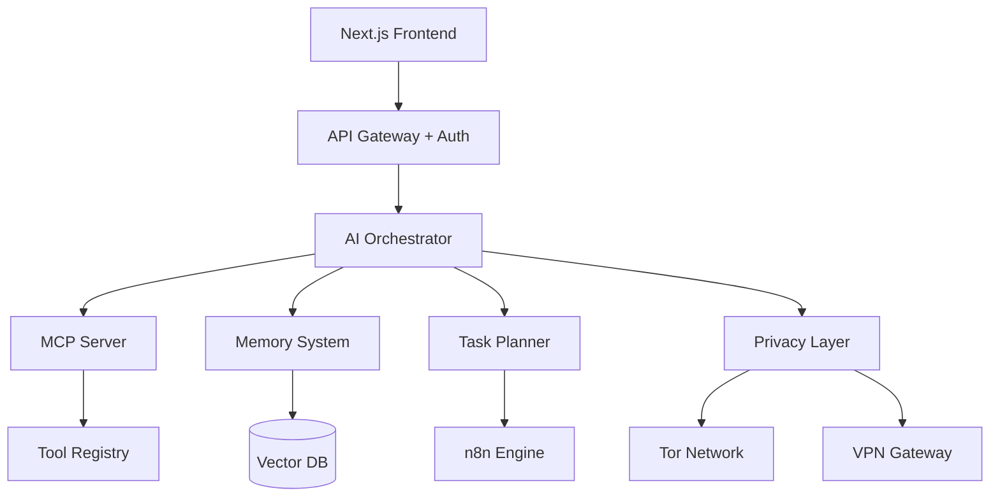
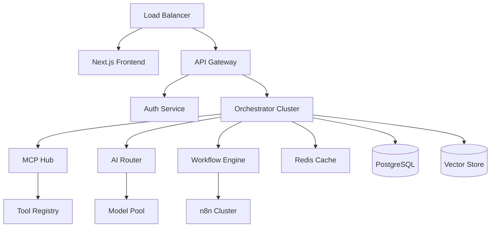

# Technical Roadmap - Agnostic AI Agent Layer

## Architecture Evolution

### Phase 1: Foundation Architecture


### Phase 2: Enhanced Architecture


### Phase 3: Production Architecture


---

## Technology Stack Evolution

### Phase 1: MVP Stack
| Component | Technology | Justification |
|-----------|------------|---------------|
| **Backend** | Node.js + Express | Fast development, n8n compatibility |
| **Frontend** | React + Vite | Simple, fast builds |
| **Database** | SQLite | Local, zero-config |
| **AI Router** | OpenRouter SDK | Multi-provider abstraction |
| **Containerization** | Docker + Docker Compose | Self-hosting simplicity |
| **Privacy** | HTTP Proxy | Basic anonymization |

### Phase 2: Beta Stack
| Component | Technology | Justification |
|-----------|------------|---------------|
| **Backend** | Node.js + Fastify | Better performance |
| **Frontend** | Next.js | SSR, better UX |
| **Database** | SQLite + PostgreSQL option | Flexibility |
| **Vector Store** | Chroma | Local embeddings |
| **AI Framework** | LangChain + MCP | Standard protocols |
| **Privacy** | Tor client + Vault | Enhanced security |
| **Testing** | Jest + Cypress | Comprehensive testing |

### Phase 3: Production Stack
| Component | Technology | Justification |
|-----------|------------|---------------|
| **Backend** | Node.js + Kubernetes | Scalability |
| **Frontend** | Next.js + CDN | Global performance |
| **Database** | PostgreSQL cluster | Enterprise reliability |
| **Message Queue** | Redis/BullMQ | Async processing |
| **Monitoring** | Prometheus + Grafana | Observability |
| **Security** | OAuth2 + RBAC | Enterprise auth |
| **Deployment** | Helm charts | Standardized deployment |

---

## API Design Evolution

### Phase 1: Basic REST API
```typescript
// Core endpoints
POST /api/v1/chat/message          // Send message to agent
GET  /api/v1/workflows             // List workflows
POST /api/v1/workflows/execute     // Execute workflow
GET  /api/v1/status                // System status
POST /api/v1/settings              // Update settings
```

### Phase 2: Enhanced API
```typescript
// Enhanced endpoints
POST /api/v2/agents/chat           // Multi-turn conversations
GET  /api/v2/agents/memory         // Agent memory management
POST /api/v2/tools/discover        // Tool discovery
GET  /api/v2/tools/registry        // Available tools
POST /api/v2/workflows/generate    // AI-generated workflows
GET  /api/v2/analytics/dashboard   // Usage analytics
POST /api/v2/privacy/configure     // Privacy settings
```

### Phase 3: Full API Suite
```typescript
// Enterprise endpoints
POST /api/v3/teams/agents          // Team collaboration
GET  /api/v3/enterprise/audit      // Audit logs
POST /api/v3/integrations/custom   // Custom integrations
GET  /api/v3/marketplace/tools     // Tool marketplace
POST /api/v3/ai/models/deploy      // Model deployment
GET  /api/v3/monitoring/metrics    // System metrics
```

---

## Data Models

### Core Entities
```typescript
interface User {
  id: string;
  email: string;
  preferences: UserPreferences;
  createdAt: Date;
  updatedAt: Date;
}

interface Agent {
  id: string;
  userId: string;
  name: string;
  model: string;
  systemPrompt: string;
  memory: AgentMemory;
  tools: string[];
  status: 'active' | 'paused' | 'archived';
}

interface Workflow {
  id: string;
  name: string;
  description: string;
  nodes: WorkflowNode[];
  triggers: WorkflowTrigger[];
  schedule?: string;
  isActive: boolean;
  createdBy: string;
}

interface Task {
  id: string;
  agentId: string;
  goal: string;
  status: 'pending' | 'running' | 'completed' | 'failed';
  steps: TaskStep[];
  result?: any;
  error?: string;
  createdAt: Date;
}
```

---

## Security Implementation Plan

### Phase 1: Basic Security
- [ ] HTTPS/TLS for all communications
- [ ] API key authentication
- [ ] Basic input validation
- [ ] Local data encryption at rest
- [ ] No external telemetry

### Phase 2: Enhanced Security
- [ ] OAuth2 integration
- [ ] Role-based access control
- [ ] Comprehensive input sanitization
- [ ] Tor network integration
- [ ] Vault for secrets management
- [ ] Security audit and penetration testing

### Phase 3: Enterprise Security
- [ ] SSO integration (SAML, OIDC)
- [ ] Multi-factor authentication
- [ ] Enterprise key management
- [ ] SOC2 compliance
- [ ] GDPR compliance tools
- [ ] Advanced threat detection

---

## Testing Strategy

### Unit Testing (All Phases)
```typescript
// Example test structure
describe('AI Orchestrator', () => {
  describe('Goal Parsing', () => {
    it('should parse email task correctly', async () => {
      const goal = "Send email to john@example.com about project update";
      const parsed = await orchestrator.parseGoal(goal);
      expect(parsed.action).toBe('send_email');
      expect(parsed.params.to).toBe('john@example.com');
    });
  });
});
```

### Integration Testing
- API endpoint testing
- n8n workflow execution
- AI model integration
- Database operations
- Privacy layer functionality

### End-to-End Testing
- Complete user workflows
- Error handling scenarios
- Performance under load
- Security vulnerability testing
- Privacy compliance validation

---

## Performance Targets

### Phase 1 Targets
| Metric | Target | Measurement |
|--------|--------|-------------|
| Response Time | < 5s | Simple workflow execution |
| Memory Usage | < 1GB | Container resource limit |
| Startup Time | < 30s | Full system initialization |
| Concurrent Users | 10 | Simultaneous active sessions |

### Phase 2 Targets
| Metric | Target | Measurement |
|--------|--------|-------------|
| Response Time | < 2s | Average workflow execution |
| Memory Usage | < 2GB | With vector store and cache |
| Throughput | 100 req/min | API requests handled |
| Uptime | > 99% | System availability |

### Phase 3 Targets
| Metric | Target | Measurement |
|--------|--------|-------------|
| Response Time | < 1s | P95 response time |
| Memory Usage | < 4GB | Full production deployment |
| Throughput | 1000 req/min | Peak load handling |
| Uptime | > 99.9% | Enterprise SLA |

---

## Privacy & Compliance Framework

### Data Classification
1. **Public Data**: System configurations, public APIs
2. **Internal Data**: System logs, performance metrics
3. **Confidential Data**: User credentials, workflow content
4. **Restricted Data**: Personal information, private communications

### Privacy Controls
```typescript
interface PrivacySettings {
  dataRetention: {
    logs: number;        // Days to keep logs
    memory: number;      // Days to keep agent memory
    workflows: number;   // Days to keep workflow history
  };
  externalCalls: {
    allowCloudLLM: boolean;
    allowWebRequests: boolean;
    requireTor: boolean;
    requireVPN: boolean;
  };
  anonymization: {
    stripMetadata: boolean;
    randomizeTimings: boolean;
    maskPII: boolean;
  };
}
```

### Compliance Checkpoints
- [ ] GDPR Article 25 (Privacy by Design)
- [ ] CCPA compliance for California users
- [ ] SOC2 Type II (if offering cloud service)
- [ ] ISO 27001 security standards
- [ ] OWASP security guidelines

---

## Monitoring & Observability

### Phase 1: Basic Monitoring
- Application logs (structured JSON)
- Basic health checks
- Error tracking
- Resource usage monitoring

### Phase 2: Enhanced Monitoring
- Distributed tracing
- Custom metrics dashboard
- User behavior analytics (privacy-preserving)
- Performance profiling

### Phase 3: Full Observability
- APM integration
- Real-time alerting
- Predictive monitoring
- Business intelligence dashboard

---

## Deployment Strategy

### Phase 1: Self-Hosted Only
```yaml
# docker-compose.yml
version: '3.8'
services:
  n8n:
    image: n8nio/n8n
    environment:
      - N8N_BASIC_AUTH_ACTIVE=true
  
  agent-orchestrator:
    build: ./orchestrator
    depends_on:
      - n8n
      - database
  
  frontend:
    build: ./frontend
    ports:
      - "3000:3000"
  
  database:
    image: sqlite:latest
    volumes:
      - ./data:/data
```

### Phase 2: Cloud Options
- Docker images on public registries
- Kubernetes Helm charts
- Cloud marketplace listings (AWS, GCP, Azure)
- Managed hosting option (privacy-preserving)

### Phase 3: Enterprise Deployment
- Air-gapped deployment support
- Multi-region availability
- Disaster recovery procedures
- Enterprise support packages

---

## Migration & Upgrade Strategy

### Version Compatibility
- Semantic versioning (semver)
- Backward compatibility guarantee for APIs
- Database migration scripts
- Configuration upgrade tools

### Upgrade Path
1. **0.1.x → 0.2.x**: Configuration file changes only
2. **0.2.x → 1.0.x**: Database schema migration required
3. **1.x.x → 2.x.x**: Major architecture changes, migration tool provided

---

## Open Source Strategy

### Repository Structure
```
agnostic-ai-agent/
├── packages/
│   ├── orchestrator/     # Core AI orchestrator
│   ├── frontend/         # Web interface
│   ├── mcp-server/      # Model Context Protocol server
│   ├── privacy-layer/   # Privacy and security tools
│   └── n8n-integration/ # n8n specific integration
├── docs/                # Documentation
├── examples/            # Usage examples
├── scripts/             # Development scripts
└── helm-charts/         # Kubernetes deployment
```

### Community Building
- Contributor guidelines
- Code of conduct
- Developer documentation
- Community forum/Discord
- Regular contributor meetings

### Licensing Strategy
- Core platform: AGPL v3 (ensures derivative works remain open)
- Enterprise additions: Commercial license
- Documentation: Creative Commons

---

This technical roadmap provides the detailed implementation path for building the Agnostic AI Agent Layer, ensuring we maintain focus on privacy, security, and extensibility throughout the development process.
